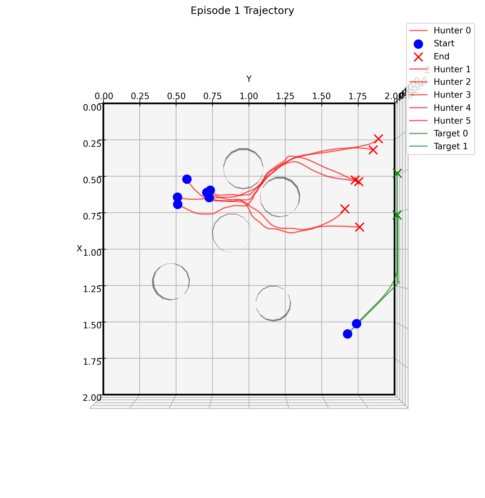
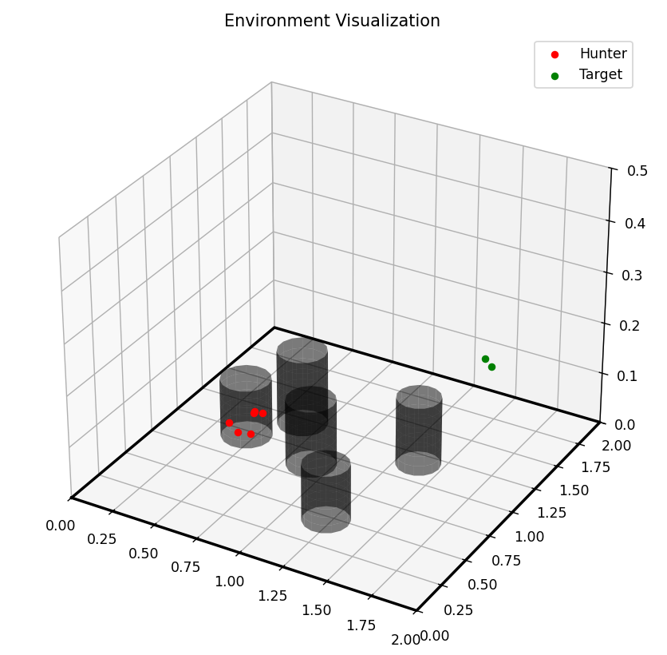

# Multi-Agent Reinforcement Learning for Target Pursuit

This project implements a Multi-Agent Twin Delayed Deep Deterministic Policy Gradient (MATD3) algorithm for a pursuit-evasion scenario with multiple hunters and targets in a 2D environment with obstacles.




## Environment

The simulation environment consists of:
- Multiple hunter agents (pursuers)
- Multiple target agents (evaders)
- Obstacles in a bounded 2D space
- Agents equipped with laser sensors for obstacle and agent detection

## Project Structure

```
KF_AA_MARL/
├── data_train/          # Training logs and data
├── model/               # Saved model checkpoints
├── run.py               # Entry point script
├── scripts/             # Training and testing scripts
│   ├── train.bat        # Windows training script
│   ├── train.sh         # Linux/Mac training script
│   ├── test.bat         # Windows testing script
│   ├── test.sh          # Linux/Mac testing script
│   ├── train_continue.bat # Windows continue training script
│   ├── train_continue.sh # Linux/Mac continue training script
│   ├── plot.bat         # Windows plotting script
│   └── plot.sh          # Linux/Mac plotting script
└── src/                 # Source code      
    ├── main.py          # Main training script
    ├── test_model.py    # Script for testing trained models
    ├── plotcurve.py     # Script for plotting reward curves
    ├── MultiTargetEnv.py # Environment implementation
    ├── MATD3.py         # MATD3 algorithm implementation
    ├── replaybuffer.py  # Experience replay buffer implementation
    ├── Lidar.py         # Lidar sensor implementation
    └── utils.py         # Utility functions
```

## Installation

1. Clone the repository:
```bash
git clone https://github.com/yourusername/KF_AA_MARL.git
cd KF_AA_MARL
```

2. Create a virtual environment (recommended):

#### Using venv:
```bash
python -m venv venv 
source venv/bin/activate   # On Windows: venv\Scripts\activate
```
#### Using conda:
```bash
conda create -n marl_env python=3.9
conda activate marl_env
```

3. Install dependencies (PyTorch should be installed separately according to your system):
```bash
pip install -r requirements.txt
pip install torch torchvision torchaudio --index-url https://download.pytorch.org/whl/cu118
```

## Quick Usage

### Using the Entry Point Script (Recommended)

The simplest way to run the project is using the entry point script:

```bash
# Train from scratch
python run.py train

# Continue training from a checkpoint
python run.py train_continue

# Test a pre-trained model
python run.py test

# Plot training rewards (uses the most recent training data)
python run.py plot

# Plot training rewards from a specific CSV file
python run.py plot --file_path "data_train/20241223_133158/rewards.csv"
```

You may need to edit the batch files to modify the model paths or other parameters.

## Key Parameters

- `num_hunters`: Number of hunter agents (default: 6)
- `num_targets`: Number of target agents (default: 2)
- `num_obstacle`: Number of obstacles (default: 5)
- `env_length`: Environment boundary size in km (default: 2.0)
- `num_episodes`: Number of training episodes (default: 500)
- `max_steps`: Maximum steps per episode (default: 150)
- `checkpoint`: Path to model directory for continuing training

## Pre-trained Models

Pre-trained models are available in the `model/` directory. The naming convention is:
`{timestamp}_{save_reason}`

For example:
- `20241223_133158_score_550` - Model saved on December 23, 2023, at 13:31:58 with a score of 550

## Additions to Test Mode

The testing mode offers two ways of visualizing agent behaviors:

1. **Real-time Rendering Mode** (default): 
   - Set `--ifrender true` to observe the simulation in real-time
   - Interactive 3D viewing angle can be adjusted during simulation
   - Provides immediate visual feedback of agent behaviors

2. **Trajectory Generation Mode**:
   - Set `--ifrender false` to run tests without real-time rendering
   - Automatically generates top-down trajectory images in the `output/` directory
   - Each image shows complete agent paths throughout the entire episode
   - Color coding: hunters (red), targets (green), starting positions (blue), ending positions (red/green X)

To use the trajectory generation mode, just tune the --ifrender from true to false.

Additional test parameters:
- `--num_test_episodes`: Number of test episodes to run (default: 5)
- `--visualizelaser`: Whether to visualize laser sensors (default: false)
- `--seed`: Random seed for testing generalization (default: 20)

The trajectory images are saved with timestamps in the filename format: `trajectory_{episode}_{timestamp}.png`

## Results Visualization

Training results are saved in the `data_train` directory. Each training run creates a new timestamped folder containing rewards.csv that logs the rewards of hunters and targets for each episode.

You can visualize these results using the plotting functionality:

```bash
# Plot the latest training results
python run.py plot

# Plot a specific training result by providing the CSV file path:
python run.py plot --file_path "data_train/20241223_133158/rewards.csv"
```