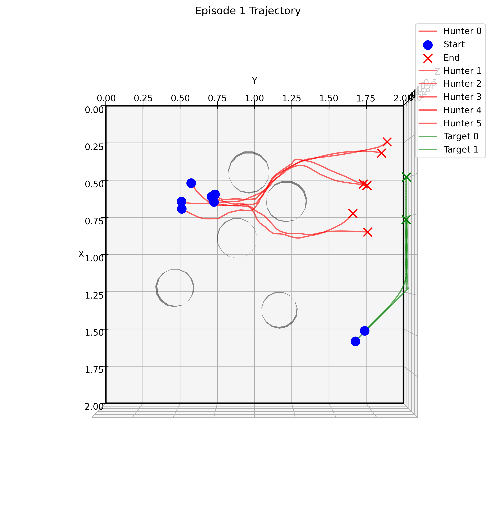
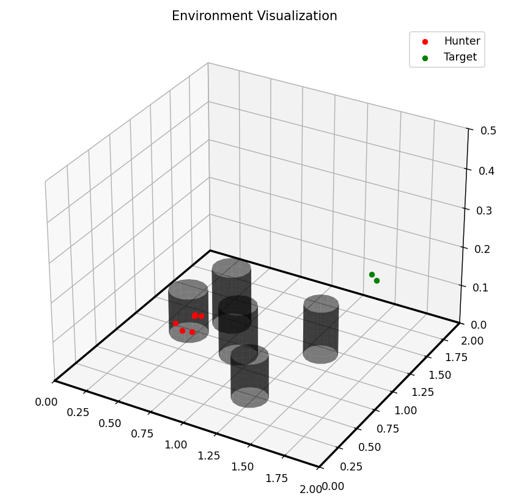

[中文](README_zh.md) | [English](README.md)

# 基于MATD3的多目标围捕

本项目实现了基于多智能体双延迟深度确定性策略梯度（MATD3）算法的追逃博弈仿真，包含多个追击者和逃逸者在带有障碍物的2D环境（伪3D，可以扩展到3D）中的对抗场景。

系统包含以下核心增强功能：
- 基于密度场的目标分配机制（综合聚集效应、速度匹配、障碍物衰减）
- 基于参考速度矢量的智能逃逸策略（逃逸向量 + 避障向量）
- 基于卡尔曼滤波的hunter角色分配（chaser/interceptor协同）
- 自动化验证流水线（支持YAML/JSON配置、批量验证、视频生成）

<div align="center">
    
</div>

<div align="center">
    
</div>

## 仿真环境

仿真环境包含：
- 多个猎人智能体（hunters）
- 多个逃逸者智能体（evaders）
- 带有障碍物的有界2D空间
- 智能体配备激光雷达传感器（可探测障碍物和其他智能体）

## 项目文件结构

```
KF_AA_MARL/
├── run.py               # 统一入口脚本
├── config.yaml          # 统一配置文件
├── data_train/          # 训练日志和数据
├── model/               # 模型检查点保存目录
├── output/              # 验证输出目录
├── scripts/             # 备用shell脚本
├── tests/               # 集成测试
│   └── test_integration.py
└── src/                 # 源代码
    ├── main.py          # 训练主函数
    ├── plotcurve.py     # 绘制曲线
    ├── MultiTargetEnv.py # 强化学习环境
    ├── MATD3.py         # MATD3算法
    ├── replaybuffer.py  # 经验回放区
    ├── Lidar.py         # 模拟的雷达传感器
    ├── utils.py         # 工具函数
    ├── density_field_allocator.py  # 密度场目标分配器
    ├── reference_velocity_calculator.py  # 参考速度计算器
    ├── kalman_filter.py  # 卡尔曼滤波器
    ├── role_assigner.py  # 角色分配器
    └── validation_pipeline.py  # 验证流水线
```

## 安装指南

1. 克隆仓库：
```bash
git clone https://github.com/yourusername/KF_AA_MARL.git
cd KF_AA_MARL
```

2. 创建虚拟环境（推荐）：

#### 使用 venv:
```bash
python -m venv venv 
source venv/bin/activate   # Windows中: venv\Scripts\activate
```
#### 使用 conda:
```bash
conda create -n marl_env python=3.9
conda activate marl_env
```

3. 安装依赖 (PyTorch根据系统的cuda版本独立安装):
```bash
pip install -r requirements.txt
pip install torch torchvision torchaudio --index-url https://download.pytorch.org/whl/cu118
```

## 快速使用

所有操作通过 `run.py` 统一入口，配置统一在 `config.yaml` 中管理：

```bash
# 训练
python run.py train

# 从已保存模型继续训练（需在config.yaml中设置training.checkpoint或model.path）
python run.py train_continue

# 测试预训练模型（实时渲染）
python run.py test

# 运行验证流水线（批量测试 + 生成报告/视频）
python run.py validate

# 绘制训练奖励曲线
python run.py plot
python run.py plot --file_path "data_train/20241223_133158/rewards.csv"

# 使用自定义配置文件
python run.py train --config my_config.yaml
```

验证结果保存在 `output/{timestamp}_validation/` 目录，包含图片、视频、日志和配置备份。

### 运行集成测试

```bash
python -m unittest tests.test_integration -v
```

## 配置说明

所有参数在 `config.yaml` 中统一管理，包含以下部分：

- `environment`: 环境参数（hunter/target数量、障碍物、边长）
- `model`: 模型路径和观测维度
- `training`: 训练超参数（学习率、折扣因子、缓冲区大小等）
- `test`: 测试参数（回合数、是否渲染）
- `validation`: 验证流水线参数（回合数、帧间隔）
- `output`: 输出配置（图片、视频、日志）

## 预训练模型

预训练模型保存在`model/`目录，命名格式为：`{时间戳}_{保存原因}_分数`

例如:
- `20241223_133158_score_550` - 表示2024年12月23日13:31保存，得分为550的模型

## 测试模式说明

测试模式加载训练好的模型并运行可视化：

```bash
python run.py test
```

在 `config.yaml` 的 `test` 部分可配置：
- `num_episodes`: 测试回合数（默认：5）
- `ifrender`: 是否实时渲染（默认：true）
- `visualizelaser`: 是否可视化激光雷达（默认：false）
- `seed`: 随机种子（默认：10）

## 结果可视化

训练结果保存在`data_train`目录。可以运行如下命令查看训练奖励曲线:

```bash
python run.py plot
python run.py plot --file_path "data_train/20241223_133158/rewards.csv"
```

## 作者注
本项目已实现密度场目标分配、参考速度逃逸策略、卡尔曼滤波角色分配和自动验证流水线等核心增强功能。目前模型训练效果仍有优化空间（详见 `system_evaluation.md`），欢迎大家提交PR，如果我看到良好的分支，我会合并并将您列为项目贡献者：）
