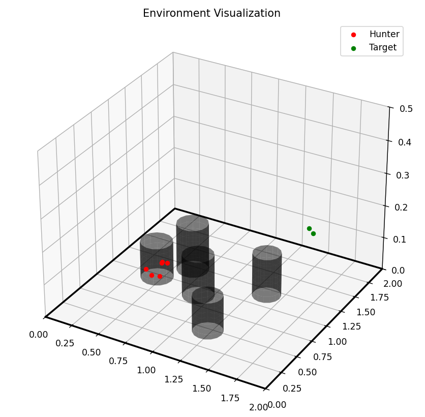

# 基于MATD3的多目标围捕

本项目实现了基于多智能体双延迟深度确定性策略梯度（MATD3）算法的追逃博弈仿真，包含多个追击者和逃逸者在带有障碍物的2D环境（伪3D，可以扩展到3D）中的对抗场景。

<div align="center">
    
</div>

<div align="center">
    
</div>

## 仿真环境

仿真环境包含：
- 多个猎人智能体（hunters）
- 多个逃逸者智能体（evaders）
- 带有障碍物的有界2D空间
- 智能体配备激光雷达传感器（可探测障碍物和其他智能体）

## 项目文件结构

```
KF_AA_MARL/
├── data_train/          # 训练日志和数据
├── model/               # 模型检查点保存目录
├── run.py               # 主入口脚本
├── scripts/             # 训练测试脚本
│   ├── train.bat        # Windows训练脚本
│   ├── train.sh         # Linux/Mac训练脚本
│   ├── test.bat         # Windows测试脚本
│   ├── test.sh          # Linux/Mac测试脚本
│   ├── train_continue.bat # Windows继续训练
│   ├── train_continue.sh # Linux/Mac继续训练
│   ├── plot.bat         # Windows绘制曲线
│   └── plot.sh          # Linux/Mac绘制曲线
└── src/                 # 源代码
    ├── main.py          # 主函数
    ├── test_model.py    # 测试模型代码
    ├── plotcurve.py     # 绘制曲线代码
    ├── MultiTargetEnv.py # 强化学习环境
    ├── MATD3.py         # MATD3算法
    ├── replaybuffer.py  # 经验回放区
    ├── Lidar.py         # 模拟的雷达传感器
    └── utils.py         # 使用函数方法等
```

## 安装指南

1. 克隆仓库：
```bash
git clone https://github.com/yourusername/KF_AA_MARL.git
cd KF_AA_MARL
```

2. 创建虚拟环境（推荐）：

#### 使用 venv:
```bash
python -m venv venv 
source venv/bin/activate   # Windows中: venv\Scripts\activate
```
#### 使用 conda:
```bash
conda create -n marl_env python=3.9
conda activate marl_env
```

3. 安装依赖 (PyTorch根据系统的cuda版本独立安装):
```bash
pip install -r requirements.txt
pip install torch torchvision torchaudio --index-url https://download.pytorch.org/whl/cu118
```

## 快速使用

### 通过入口脚本运行（推荐）

这是最简单的方式运行本项目:

```bash
# 新训练
python run.py train

# 从已保存模型继续训练
python run.py train_continue

# 测试预训练模型
python run.py test
```

如果有需要，可以前往具体的批处理文件(`scripts/*.batch` 或 `scripts/*.sh`)来自定义有关参数

## 主要参数

- `num_hunters`: 猎人数量（默认：6）
- `num_targets`: 逃逸者数量（默认：2）
- `num_obstacle`: 障碍物数 (default: 5)
- `env_length`: 环境边界尺寸（单位：千米，默认：2.0）
- `num_episodes`: 训练回合数（默认：500）
- `max_steps`: 单回合最大步数 (默认：150)
- `checkpoint`: 继续训练用到的已有模型保存路径

## 预训练模型

预训练模型保存在`model/`目录，命名格式为：`{时间戳}_{保存原因}_分数`

例如:
- `20241223_133158_score_550` - 表示2024年12月23日13:31保存，得分为550的模型

## 测试模式说明

测试时支持两种可视化模式：

1. **实时渲染模式​​（默认）：**
   - 设置 `--ifrender true` 可以实时渲染
   - 可调整3D观察视角
   - 提供即时行为反馈

2. **轨迹生成模式​​：**
   - 设置 `--ifrender false`
   - 自动生成鸟瞰轨迹图在`output/`
   - 每张图展示整个回合的各个智能体移动路径
   - 颜色标识：猎人（红色），逃逸者（绿色），起点（蓝色），终点（X标记）

要使用轨迹生成模式，只要把ifrender参数从true调成false

其他测试参数:
- `--num_test_episodes`: 测试回合数 （默认：5）
- `--visualizelaser`: 是否可视化激光雷达（默认：否）
- `--seed`: 设置随机种子来测试泛化性（默认 10，这里有时候障碍物会随机生成到智能体位置，我暂时没有解决）

轨迹图命名格式：`trajectory_{回合数}_{时间戳}.png`

## 结果可视化

训练结果保存在`data_train`目录。每次训练都会生成带时间戳的新文件夹，其中包含记录每个回合奖励的`rewards.csv`文件。

可以运行如下命令来查看训练奖励曲线:

```bash
# 绘制奖励曲线 (使用的是刚训练得到的模型)
python run.py plot

# 绘制奖励曲线（从具体的表格数据路径）
python run.py plot --file_path "data_train/20241223_133158/rewards.csv"
```

## Notice
由于我没有训练好逃逸者（可以在图中看出来），并且部分功能（包括目标分配、猎人角色分配等）尚未实现，我已在代码中用#TODO标记。由于个人原因，我目前没有余力继续开发这些功能，有点遗憾，欢迎大家提交PR，如果我看到良好的分支，我会合并并将您列为项目贡献者：）